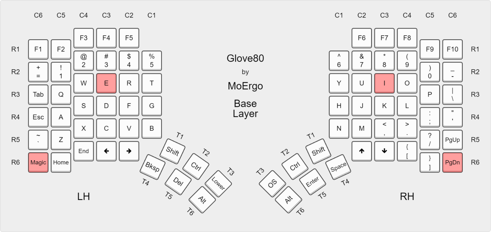

#+title:   Digitum
#+startup: content

ZMK firmware for Glove80 with [[https://github.com/sunaku/engrammer][Engrammer]] layout, powered by [[https://github.com/lilyinstarlight/zmk-nix][zmk-nix]].

** Acknowledgments
This keymap draws inspiration from:
- [[https://github.com/sunaku/glove80-keymaps][sunaku's Glorious Engrammer]] - app switcher behavior, bilateral home row mods, per-finger timing
- [[https://github.com/manna-harbour/miryoku][Miryoku]] - layer architecture and thumb cluster philosophy
- [[https://github.com/jcf/glove80-keymaps][jcf/glove80-keymaps]] - previous fork with Engrammer adaptations

* Features

** Engrammer Layout
Arno's Engram optimized for programmers. Vowels clustered on left hand, punctuation in center columns.
#+begin_example
b y o u  '  ;  l d w v z
c i e a  ,  .  h t s n q
g x j k  -  /  r m f p
#+end_example

** Home Row Mods
Hold home row keys for modifiers, tap for letters. Bilateral enforcement prevents same-hand misfires.
| Finger | Left | Right |
|--------+------+-------|
| Index  | Ctrl | Ctrl  |
| Middle | Shft | Shft  |
| Ring   | Alt  | Alt   |
| Pinky  | Cmd  | Cmd   |

** Per-Finger Timing
Slower fingers get more time to avoid accidental activations (inspired by [[https://github.com/sunaku/glove80-keymaps][sunaku]]).
| Finger | Time  |
|--------+-------|
| Index  | 180ms |
| Middle | 210ms |
| Ring   | 240ms |
| Pinky  | 270ms |

** Top Row Mods
Hold for Hyper/Meh above home row (pinky/ring protected):
| Finger | Modifier                   |
|--------+----------------------------|
| Index  | Hyper (Ctrl+Shift+Alt+Cmd) |
| Middle | Meh (Ctrl+Shift+Alt)       |
| Ring   | —                          |
| Pinky  | —                          |

** Layers
| Layer    | Access           | Purpose                      |
|----------+------------------+------------------------------|
| Base     | default          | Engrammer with home row mods |
| Cursor   | hold SPACE       | Navigation, text editing     |
| Number   | hold BSPC        | Numpad, hex digits           |
| Function | hold ESC         | F1-F15, media controls       |
| Symbol   | hold RETURN      | Programming symbols          |
| Mouse    | hold TAB (right) | Mouse movement, scroll       |
| System   | hold ESC (right) | RGB controls, power, locks   |
| Lower    | inner thumbs     | Layer toggles, sticky mods   |
| Magic    | outer corners    | Bluetooth, bootloader, reset |

** Thumb Clusters
#+begin_example
Upper:  ESC/Fn   UP    DOWN  |  LEFT   RIGHT   ESC/Sys
Lower:  SPC/Cur  BSP/Num  Lower | Lower  TAB/Mouse  RET/Sym
#+end_example

** Combos
Thumb-only combos (ergonomic, no lateral finger strain):
| Keys          | Action                    |
|---------------+---------------------------|
| ESC + SPC     | Cmd+Tab app switcher      |
| ESC/Sys + ENT | Launchbar (Meh+L)         |
| TAB + ENT     | Screenshot (Cmd+Shift+4)  |
| SPC + BSP     | Home Row (Cmd+Opt+Ctrl+/) |

** App Switcher
ESC + SPACE (left thumb keys) activates Cmd+Tab with navigation:
1. Hold the combo to activate
2. Cmd is held, Tab is tapped (shows app switcher)
3. Cursor layer activates for arrow key navigation
4. Release combo to select app and deactivate Cmd

** Mouse Keys
Full mouse control on Mouse layer (hold TAB on right thumb):
- Movement: arrows on home row (left, up, down, right)
- Scrolling: on left hand and bottom row
- Clicks: left, middle, right on thumb cluster and home row

** Special Behaviors
- *CapsWord*: Dedicated key (types in CAPS until space/punctuation)
- *Parang*: Bottom row brackets morph with shift (tap for =()=, shift for =<>=)

* Tasks
#+begin_src sh :results output verbatim
just --list
#+end_src

#+results:
: Available recipes:
:     [deploy]
:     build  # Build firmware
:     flash  # Copy `uf2` firmware files to controllers
:
:     [dev]
:     draw   # Generate keymap visualization
:     fmt    # Format project files
:     update # Update West dependencies and bump `zephyrDepsHash`

* Flashing

** Build
#+begin_src sh
just build
#+end_src

** Enter Bootloader Mode
For each half:

1. Switch off power
2. Connect USB cable
3. Hold two keys while switching power on:
   - The key directly above your middle finger's home position
   - The bottom outer corner key of the main key area

A slow pulsing red LED (near power switch) confirms bootloader mode.

** Copy Firmware
#+begin_src sh
just flash
#+end_src

The volume unmounts automatically when complete.

* Customization
All settings are in =config/glove80.keymap= header:
- =TAPPING_TERM=: Base timing (increase if accidental holds)
- =HRM_*=: Home row mod assignments
- =TOP_*=: Top row mod assignments
- =THUMB_*=: Thumb cluster keys
- =COMBO_TIMEOUT=: Combo press window
